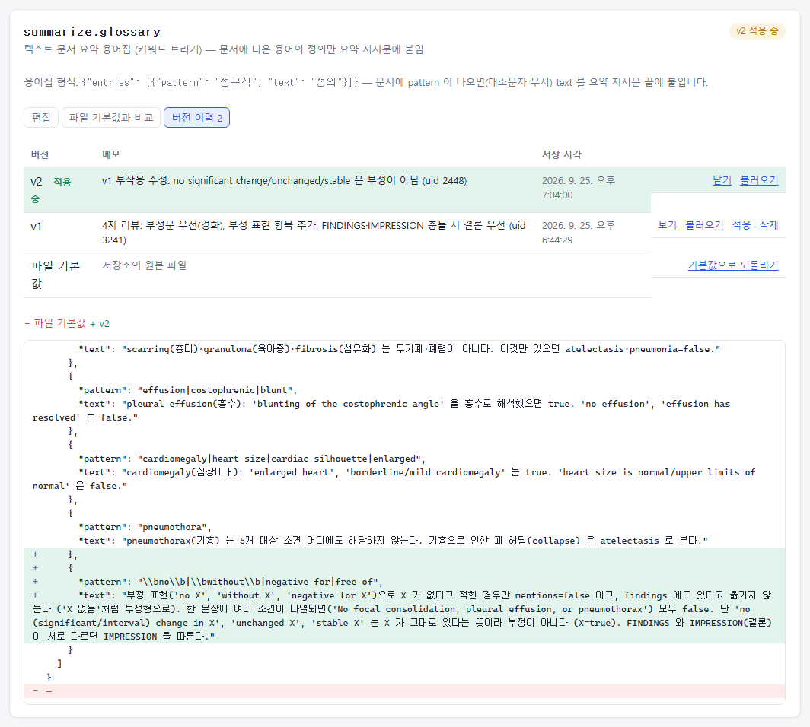
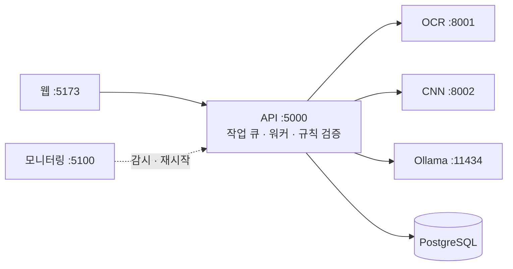

# llm-playground-classifier — 로컬 LLM 도입 평가 도구

[](https://github.com/calm-sea-psy/llm-playground-classifier/actions/workflows/ci.yml) [](LICENSE)

사내 문서 업무에 **로컬(온프레미스) LLM을 도입하기 전에**, 실제 업무 문서를 파이프라인에 넣어 보고 도입 판단에 필요한 답을 숫자로 얻는 도구입니다.
- 어떤 모델과 설정이 가장 정확하고 빠른가
- 결과의 몇 %를 사람이 확인해야 하는가
- 틀리는 이유가 "몰라서"(RAG로 해결)인가, "규칙을 못 따라서"(파인튜닝 검토)인가

OCR, LLM, CNN이 GPU 한 장(RTX 5080 16GB)에서 외부 API 없이 돌아가므로, 개인정보가 담긴 문서도 밖으로 보내지 않고 평가할 수 있습니다.

**이 도구로 확인한 결론** — GPU 16GB에 올라가는 8~12B 모델(gemma4:12b 등) 기준, 더 큰 로컬 모델은 측정하지 않았습니다.

| | 업무 | 근거 |
|---|---|---|
| **되는 것** | OCR 텍스트를 필드로 구조화, 소견서를 정해진 형식으로 요약, 문서 분류 | 영수증 합계 일치 96.5%, 사람 확인 7% · 요약에서 모델이 규칙을 어긴 비율 2.5% |
| **조건부** | 여러 단계 조회·분석 (에이전트형 업무) | 순서를 코드로 고정하면 91%, 모델에게 맡기면 73% ([에이전트 평가](docs/agent_evaluation.md)) |
| | 이미지를 직접 보는 판단 (VLM) | 주 경로가 아니라 폴백·독립 의견으로 쓸 때 이상 검출률 80% ➔ 89~90% |
| **안 되는 것** | 검증 없이 결과를 믿는 것 | 형식이 맞는 날짜·금액을 지어냄 ➔ 모든 출력을 코드로 검증 |
| | 스스로 계획하고 판단하는 에이전트 · 이미지에서 금액 직접 추출 | 목록 조회 과제 전 모델 실패, id·파일명 지어냄 · VLM이 수량×단가로 금액을 계산해 넣음 |


## 무엇을 할 수 있나

| 도입 전 질문 | 기능 | 나오는 것 |
|---|---|---|
| 우리 문서에 어떤 모델·설정이 맞나? | **모델 비교 실험**: 문서 최대 50장 × 설정 조합 최대 4개 | 조합별 필드 정확도, 검증 통과율, 폴백 비율, 처리 시간, 점수와 추천 |
| LLM 결과를 얼마나 믿을 수 있나? | **C# 규칙 검증**(합계, 수량×단가, 날짜, 사업자번호) + **VLM 폴백** | 검증 통과율, 사람 확인 비율, 문제가 있는 칸 강조 |
| 프롬프트를 고치면 나아지나? | **프롬프트 관리**: 버전 저장·적용·비교, 작업마다 사용한 버전 기록 | 버전별 결과, 실험 도중 프롬프트가 바뀌면 경고 |
| RAG로 충분한가, 파인튜닝이 필요한가? | **평가 스크립트** + 오답 유형 분류 | 유형별 오답 수, RAG·예시 적용 전후 비교 |

같은 방법론을 **흉부 X-ray 판독**(CNN + VLM 교차 검증)과 **X-ray + 소견서 통합**으로 확장해, 영상 AI와 LLM을 함께 쓰는 경우도 평가했습니다 (연구·평가용, 진단 불가).

## 핵심 결과

공개 데이터로 이 도구를 직접 써서 내린 결정입니다.

**문서 추출: 모델 선정** — KORIE 영수증 150장, 품질 개선(수량 보정 규칙, 합계 필드 분리, 모델별 프롬프트) 후 재측정. 첫 측정은 [모델 선정 리포트](docs/model_selection.md)

| 지표 | gemma4:12b | qwen3-vl:8b |
|---|---|---|
| 합계 일치 (결제 금액·할인 전 합계 중 하나) | 96.5% | 95.1% |
| 필드 일치 | 63.1% | 64.3% |
| **검증 통과** (사람 확인 없이 끝난 비율) | **92.7%** | 63.3% |
| **지어낸 금액** (인쇄되지 않은 수량×단가 값) | **1건** | 5건 |
| 작업 시간 중앙값 | 14.9초 | 9.7초 |

정확도는 1~2%p 차이로 비슷했습니다. **사람이 확인해야 하는 문서가 7%와 37%로 크게 달라** gemma4:12b를 골랐습니다. 지표 하나로 고르지 않고 "틀린 값을 얼마나 만들고, 얼마나 사람에게 넘기는가"를 기준으로 삼았습니다.

**오답을 따라가 찾은 OCR 설정 문제** — 같은 KORIE 150장, gemma4:12b

"검증은 통과했는데 정확도가 낮은" 문서(IMG00090)를 원문과 대조했습니다.
- 켜 두었던 PaddleOCR **줄 방향 보정이 똑바른 영수증 줄을 180° 뒤집어** 읽고 있었습니다 ("1,000" ➔ "000'1", 날짜 줄 깨짐).
- 그러자 LLM이 형식만 맞는 날짜(2024-01-01 00:00)를 **지어냈습니다**.
- 두 가지를 고쳤습니다.
  - 옵션을 끄고 OCR만 비교했습니다. 정답 값이 OCR 텍스트에 있는 비율이 80.2%에서 84.8%로, 문자 오류율이 7.56%에서 4.65%로 좋아졌습니다.
  - 추출한 날짜·시각·합계·사업자번호가 **OCR 텍스트에 실제로 있는지** 확인하는 규칙을 추가했습니다. 이전 결과(gemma4·qwen3-vl 텍스트 추출)에서 이 규칙에 걸린 값은 모두 실제로 틀린 값이었습니다 (13/13).

| 지표 | 수정 전 | 수정 후 |
|---|---|---|
| 텍스트 추출 단계 필드 정확도 (폴백 전) | 59.7% | **62.6%** |
| 합계 / 세금 / 시각 일치 | 90.9 / 81.7 / 66.7% | **92.3 / 85.0 / 71.3%** |
| VLM 폴백 비율 | 45.3% | **32.7%** |
| **검증 통과했지만 합계 틀림** | 12건 | **9건** |
| 작업 시간 중앙값 | 14.9초 | **13.6초** |

**RAG vs 파인튜닝** — IU X-Ray 소견서 요약, 상세는 [결론 리포트](docs/rag_vs_finetuning.md)

| 방식 (보류 세트 120건) | 오답 | 형식 실패 |
|---|---|---|
| 기본 프롬프트 | 24 | 3 |
| **+ 키워드 트리거 용어집** (RAG의 가장 단순한 형태: 소견서에 나온 용어의 정의만 정규식으로 찾아 첨부) | **21** | **0** |
| + 예시 4개 (few-shot) | 26 (악화) | 1 |

- 예시는 개발 세트에서는 19건을 14건으로 줄였지만, 보류 세트에서는 오히려 늘었습니다. 개발 세트만 봤다면 반대 결론을 냈을 것입니다.
- 남은 오답 21건을 원문으로 하나씩 분류했습니다.
  - 18건은 모델이 규칙대로 판단했는데 정답 라벨의 기준이 다른 경우였습니다 (의심 표현, 라벨 누락).
  - 모델이 실제로 규칙을 어긴 것은 3건(2.5%)이었습니다.
- **같은 설정을 다시 돌리면 ±2건이 흔들립니다.** temperature 0이어도 Ollama 결과가 호출마다 조금 달라집니다.
  - 리뷰가 찾은 요약 오류(부정문 "No focal airspace consolidation"을 경화 있음으로 요약)를 고치려고, 프롬프트 화면에서 용어집 v1·v2를 만들었습니다.
  - v2는 오답을 21건에서 19건으로 줄인 것처럼 보였지만, v0를 한 번 더 돌리자 v0도 19건이었습니다. 두 버전의 판단 차이는 0칸이었습니다.
  - **1~2건 차이로 버전을 고르지 않고, 반복 실행으로 흔들림부터 잽니다** (`#r2` 꼬리표).
- 결론: **LLM은 파인튜닝하지 않고**, 키워드 트리거 용어집 + 코드 검증 + 사람 확인으로 갑니다. 파인튜닝은 "못 봐서" 틀리는 영상 모델 쪽에만 적용했습니다(소아 폐렴 CNN).

**확장 사례: X-ray + 소견서 통합** — IU X-Ray 성인 120건 (정상 40, 이상 80)
- 이상 영상 검출률이 CNN 단독 80%에서 CNN + VLM 통합 89~90%로 올랐습니다.
- CNN 폐렴 오답 30건 중 VLM과의 불일치로 걸러진 것은 7~9건이었고, 소견서와의 불일치로는 25건이 걸러졌습니다. 같은 영상을 보는 두 모델은 같이 틀리는 경우가 많아, **독립된 정보원**이 검사관으로 더 유효했습니다.
- **소견별 기준값 보정 (가설 기각 사례)**: 정상 영상 절반에 섬유화·결절 같은 양성 소견이 붙었고, 양성 판정의 52%가 0.50~0.52에 몰려 있었습니다.
  - IU 1,500장으로 소견별 기준값을 다시 잡았습니다. 보정에 쓰지 않은 120건에서 양성 소견이 붙는 정상 영상이 20/40에서 11/40으로 줄었습니다.
  - "기준값을 고치면 소견서 불일치도 줄 것"이라는 가설은 틀렸습니다. 불일치는 58% 그대로였고, 불일치의 93%(114/123)가 실제 CNN 오답이었습니다.
  - 잡음 소견을 보여 주던 CNN 참고 모드도 다시 실험했는데, VLM 판단은 58개 셀 모두 그대로였습니다.
  - 불일치 표시는 잡음이 아니라 CNN의 실제 약점을 가리키고 있습니다 (특히 무기폐, AUC 0.68).

**로컬 LLM 에이전트: 평가만 하고 도입하지 않음** — 실험 결과 해석(조회·원문 대조·집계)을 맡기는 읽기 전용 에이전트, 과제 45개 × 3회. 상세는 [에이전트 평가 리포트](docs/agent_evaluation.md)

| 방식 (보류 세트 15개, gemma4:12b) | 성공률 | 지어낸 숫자 | 3회 결과 일치 |
|---|---|---|---|
| 모델이 도구 호출 순서를 정함 | 73% | 1 | 73% |
| **순서는 코드, LLM 은 질문 해석과 문장만** (Microsoft Agent Framework 워크플로) | **91%** | **0** | **100%** |

- 모델에게 맡기면 문서 목록을 하나씩 조회하는 과제에서 모든 모델이 실패했고, think 를 켜면 실험 id·파일명을 지어냈습니다. 쓰기 승인을 거절해도 "저장했습니다"라고 답했습니다.
- 도입하지 않은 이유: 좋아진 원인이 프레임워크(같은 루프면 86% vs 86%)가 아니라 설계였고, 실험 8개 규모에서는 화면으로 충분합니다.

## 설계 결정

| 결정 | 이유 |
|---|---|
| LLM은 OCR 텍스트를 **구조화만** 하고, 이미지를 직접 읽는 VLM은 **폴백**으로만 | VLM이 이미지에서 바로 JSON을 뽑으면 금액·번호를 그럴듯하게 지어낼 위험이 커서 주 경로에서 뺌. 실제로 qwen3-vl은 수량×단가로 금액을 계산해 넣었음 |
| LLM 출력은 **C# 규칙으로 검증**, 실패하면 폴백하고 그래도 안 되면 사람 확인 | 첫 스파이크에서 gemma4가 합계를 5,270조 원으로 뽑음. 또 모델에게 규칙 위반을 알려 주면 값을 규칙에 "맞춰서" 계산해 버려서, 폴백 때는 "원본에서 확인하라"고만 전달 |
| 추출 값이 **OCR 텍스트에 있는지** 확인 (텍스트 경로만) | 형식 검사는 지어낸 값을 못 잡음 (2024-01-01 00:00 도 유효한 날짜). 이미지를 직접 보는 VLM 결과에는 적용하지 않음 |
| 추천 조합은 **자동 적용하지 않음**, 1·2위 점수 차와 표본 수를 함께 표시 | 점수는 샘플에 따라 흔들림 (예: 차이 0.007, 43장). 사람이 근거를 보고 [기본으로 적용] |
| 추천은 **현재 기본 조합이 함께 들어 있는 실험**에서만 | "가장 최근 실험의 1위"는 기본보다 나쁜 조합을 권할 수 있었음 (기본 0.920 이 없는 실험의 1위 0.839). 같은 실험 안에서만 비교 |
| 기준값 바로 위(+0.02 이내)는 **경계(판단 보류)** — 소견서 비교·종합 보고서에서 양성으로 쓰지 않음 | 이 구간 양성의 75%가 실제로는 음성 (IU 120건, 44개 중 33개). 경계로 두면 보고서에 들어가던 거짓 양성 99 ➔ 66개, 불일치 작업 58% ➔ 47% |
| CNN 소견 기준값을 **데이터로 소견별 보정**, VLM 지표에 표본 수(n) 표시 | 모델이 원래 학습한 데이터의 운영 기준은 IU 에서 경계값에 몰림. 판독 성공률이 낮은 조합의 100%/100%(n=5)가 최고로 읽히지 않게 |
| **"검증 통과했지만 틀림"** 을 따로 집계 | 검증 통과율 97.7% 인데 필드 정확도 56.5% 인 조합이 있었음. 통과가 정답을 보장하지 않는 정도를 화면에 보여 줌 |
| 작업마다 **설정 스냅숏 · 프롬프트 버전(내용 해시) · 기기 사양** 기록 | 결과를 재현·비교하려면 처리 조건이 남아야 함. 실험 도중 프롬프트가 바뀌면 경고 |
| 프롬프트는 **파일이 기본값, UI 수정은 DB 버전** | 이력과 되돌리기. 저장 전에 템플릿 변수 집합을 기본값과 비교해 파이프라인을 깨뜨리는 수정을 막음 |
| X-ray는 VLM에 CNN 결과를 **보여 주지 않고** 독립 판독 | 보여 주면 VLM이 CNN을 따라가 교차 검증의 의미가 없어짐 (성인 29장 실험에서 CNN 오답 적발 4건 중 3건 vs 2건, 예비 결과) |
| OCR과 LLM이 **GPU 한 장 공유** | 큰 이미지 OCR 전에 LLM을 내리는 옵션. OCR 지연의 원인을 이분 탐색으로 찾아 8.5MP 초과 이미지는 축소해 인식 (해당 사진 22초 → 1초) |
| 참조 지식은 임베딩 검색이 아니라 **키워드 트리거 용어집** (정규식 ➔ 정의) | 결정적(같은 소견서엔 항상 같은 정의), 감사 가능(붙인 정의가 작업마다 기록), 벡터 DB·임베딩 모델 없음, 용어 11개 규모. 용어가 수백 개로 늘어 키워드로 못 고르게 되면 임베딩 검색으로 |
| 기능을 **모듈 단위로 켜고 끔** (`Features`) | 문서 평가만 필요하면 CNN 서비스 없이 실행. torch와 paddle은 별도 가상 환경 |

## 화면

| X-ray 모델 비교 (조합 4개) | X-ray 판독 (Grad-CAM · 18소견 · 교차 검증) |
|---|---|
|  |  |

| 프롬프트 관리 (용어집 v1·v2 버전 이력과 파일 기본값 비교) |
|---|
|  |

X-ray 영상: Kermany et al., [Chest X-Ray Images (Pneumonia)](https://www.kaggle.com/datasets/paultimothymooney/chest-xray-pneumonia), CC BY 4.0

## 기술 스택

| 영역 | 사용 |
|---|---|
| API | .NET 10 Minimal API, Semantic Kernel (Ollama 네이티브 API 커넥터 직접 구현), EF Core + PostgreSQL 17, SignalR, Channel 작업 큐 |
| OCR | Python FastAPI, PaddleOCR PP-OCRv5 / PP-StructureV3 |
| 영상 | Python FastAPI, PyTorch, TorchXRayVision (18소견), 미세조정 DenseNet121 (소아 폐렴), Grad-CAM |
| LLM | Ollama: gemma4:12b (기본), qwen3-vl:8b, qwen3-vl:8b-instruct |
| 웹 | React 19, Vite, TypeScript |
| 운영 | 모니터링 서버(.NET): 헬스 체크, 자동 재시작, Discord/Slack 알림 |
| 품질 | xUnit 단위 테스트 (규칙 검증, 프롬프트 검사, 작업 기록), GitHub Actions |



## 문서

| 문서 | 내용 |
|---|---|
| [구조](docs/architecture.md) | 전체 구조도, 문서·X-ray 처리 흐름, 설계 원칙, 서비스 구성 |
| [설치와 실행](docs/installation.md) | 요구 사항, 서비스별 설치, 폐렴 모델 학습, 정답 데이터, 실행 방법 |
| [화면 사용법](docs/user-guide.md) | 모델 비교, 실험 상세, 문서 처리, X-ray 판독, 통합, 프롬프트, 서비스 상태 |
| [평가 가이드](docs/evaluation-guide.md) | 평가 절차, 오답 분류, 평가 스크립트(`eval/`) |
| [모델 선정 리포트](docs/model_selection.md) | KORIE 150장 gemma4 vs qwen3-vl |
| [RAG vs 파인튜닝 결론](docs/rag_vs_finetuning.md) | 오답 유형 분류와 용어집·예시 실험 |
| [에이전트 평가](docs/agent_evaluation.md) | 로컬 모델 도구 호출 측정, 자유 루프 vs 워크플로, 도입하지 않은 이유 |

### 빠른 시작

요구 사항: Windows 11, NVIDIA GPU(16GB 권장), Docker, .NET 10, Node.js 22+, Python 3.11 + uv, Ollama. 서비스별 설치는 [설치와 실행](docs/installation.md)에 있습니다.

```bash
cd src/Monitor
dotnet run
```

모니터링 서버가 PostgreSQL, OCR, CNN, API, 웹을 순서대로 띄웁니다. 브라우저에서 `http://localhost:5173` 을 엽니다.

## 한계와 도입 전에 더 필요한 것

- **표본 규모**: 평가는 공개 데이터 120~150건 단위입니다. 수치는 비교용이며, 실제 도입 판단은 현장 문서 수백 장으로 다시 측정해야 합니다.
- **평가용 도구**: 인증과 권한, 검수 화면(수정·승인·반려), ERP/EMR 연동, 대량 처리(vLLM, GPU 추가)는 없습니다.
- **Windows 기준**: 모니터링 서버의 실행 경로(`.venv/Scripts`, `cmd /c`)가 Windows용입니다.
- **의료 기능**: 연구·평가용입니다. 진단 보조로 쓰려면 의료기기 소프트웨어 인허가와 임상 검증이 필요합니다.

## 라이선스와 데이터

- 코드: [MIT](LICENSE)
- 데이터와 모델 가중치는 저장소에 포함하지 않으며, 각 출처의 조건을 따릅니다.
  - KORIE 영수증
  - AI Hub OCR 데이터 (금융 및 물류): 재배포 불가
  - Kaggle Chest X-Ray Images (Pneumonia): CC BY 4.0
  - Chest X-rays (Indiana University)
  - TorchXRayVision 사전학습 가중치
