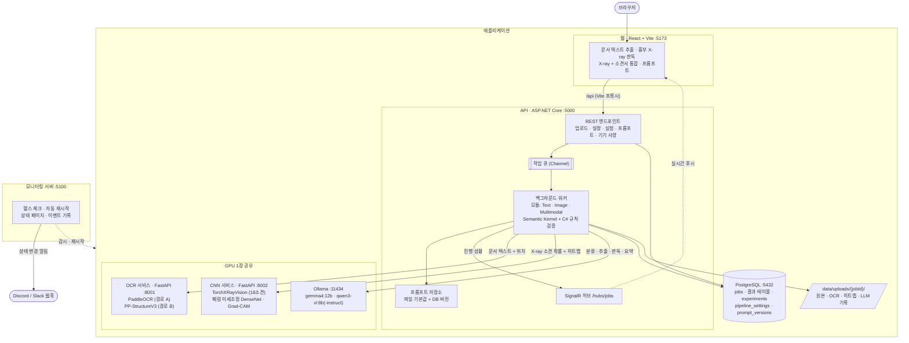
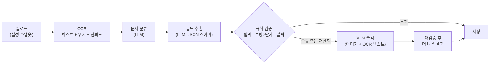
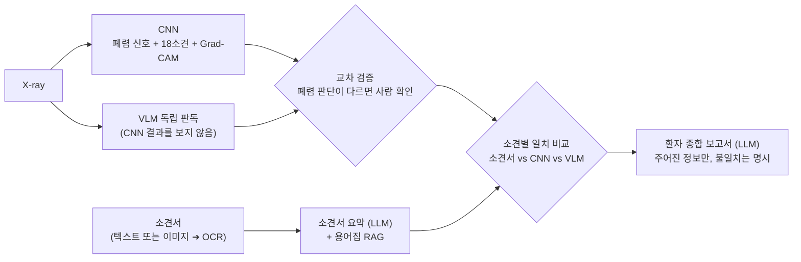

# 구조

[README](../README.md) · [구조](architecture.md) · [설치와 실행](installation.md) · [화면 사용법](user-guide.md) · [평가 가이드](evaluation-guide.md)

## 전체 구조

## 처리 흐름

**문서 텍스트 추출** (영수증, 상업송장, 보험 청구서)

**흉부 X-ray 판독**과 **X-ray + 소견서 통합**

설계 원칙은 다음과 같습니다.
- **LLM 출력은 코드로 검증합니다.** 숫자를 지어낼 수 있는 VLM은 폴백이나 독립 의견으로만 씁니다.
- **어긋나면 사람에게 넘깁니다.** 검증 오류, 출처 간 불일치, 형식 오류(1회 재시도 후)는 "사람 확인 필요"로 표시합니다.
- **모든 작업에 처리 조건을 남깁니다.** 설정 스냅숏, 사용한 프롬프트 버전, 기기 사양이 기록되어 결과를 재현하고 비교할 수 있습니다.

## 구성

| 서비스 | 위치 | 주소 |
|---|---|---|
| PostgreSQL 17 (Docker) | `docker-compose.yml` | `127.0.0.1:5432` |
| OCR 서비스 (Python, FastAPI + PaddleOCR) | `src/OcrService` | `http://127.0.0.1:8001` |
| CNN 서비스 (Python, FastAPI + PyTorch) | `src/CnnService` | `http://127.0.0.1:8002` |
| Ollama (LLM) | 별도 설치 | `http://127.0.0.1:11434` |
| API (.NET 10) | `src/Api` | `http://127.0.0.1:5000` |
| 웹 (React + Vite) | `src/Web` | **`http://localhost:5173`** |
| 모니터링 서버 (.NET 10) | `src/Monitor` | `http://127.0.0.1:5100` |
| 평가 스크립트 (Python) | `eval/` | — |

기능은 모듈 단위로 켜고 끕니다(`src/Api/appsettings.json` 의 `Features`). 예를 들어 문서 평가만 하려면 `Text` 만 켜면 되고, 그러면 CNN 서비스는 필요 없습니다.
