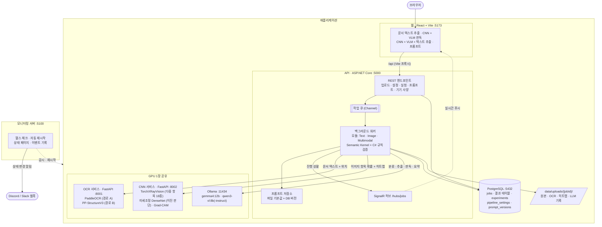
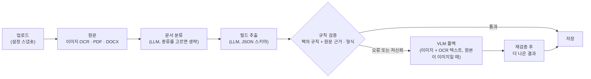
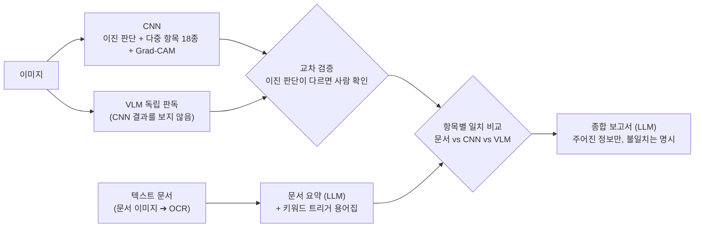

# 구조

[README](../README.md) · [구조](architecture.md) · [설치와 실행](installation.md) · [화면 사용법](user-guide.md) · [평가 가이드](evaluation-guide.md)

## 전체 구조

```mermaid
flowchart TB
    User(["브라우저"])

    subgraph Stack["애플리케이션"]
        direction TB
        subgraph Web["웹 · React + Vite :5173"]
            Pages["문서 텍스트 추출 · CNN + VLM 판독<br/>CNN + VLM + 텍스트 추출 · 프롬프트"]
        end

        subgraph Api["API · ASP.NET Core :5000"]
            Endpoints["REST 엔드포인트<br/>업로드 · 설정 · 실험 · 프롬프트 · 기기 사양"]
            Queue[["작업 큐 (Channel)"]]
            Worker["백그라운드 워커<br/>모듈: Text · Image · Multimodal<br/>Semantic Kernel + C# 규칙 검증"]
            Prompts["프롬프트 저장소<br/>파일 기본값 + DB 버전"]
            Hub["SignalR 허브 /hubs/jobs"]
        end

        subgraph Gpu["GPU 1장 공유"]
            Ocr["OCR 서비스 · FastAPI :8001<br/>PaddleOCR (경로 A)<br/>PP-StructureV3 (경로 B)"]
            Cnn["CNN 서비스 · FastAPI :8002<br/>TorchXRayVision (다중 항목 18종)<br/>미세조정 DenseNet (이진 판단) · Grad-CAM"]
            Ollama["Ollama :11434<br/>gemma4:12b · qwen3-vl:8b(-instruct)"]
        end

        Db[("PostgreSQL :5432<br/>jobs · 결과 테이블 · experiments<br/>pipeline_settings · prompt_versions")]
        Files[/"data/uploads/{jobId}/<br/>원본 · OCR · 히트맵 · LLM 기록"/]
    end

    subgraph Monitor["모니터링 서버 :5100"]
        Checker["헬스 체크 · 자동 재시작<br/>상태 페이지 · 이벤트 기록"]
    end
    Webhook(["Discord / Slack 웹훅"])

    User --> Pages
    Pages -- "/api (Vite 프록시)" --> Endpoints
    Endpoints --> Queue --> Worker
    Worker --> Prompts
    Worker -- "진행 상황" --> Hub
    Hub -. "실시간 푸시" .-> Pages
    Worker -- "문서 텍스트 + 위치" --> Ocr
    Worker -- "이미지 항목 확률 + 히트맵" --> Cnn
    Worker -- "분류 · 추출 · 판독 · 요약" --> Ollama
    Endpoints --> Db
    Worker --> Db
    Worker --> Files
    Checker -. "감시 · 재시작" .-> Stack
    Checker -- "상태 변경 알림" --> Webhook
```

## 처리 흐름

**문서 텍스트 추출** (문서 종류 팩: 영수증, 상업송장, 보험 청구서, 이력서)

```mermaid
flowchart LR
    Upload["업로드<br/>(설정 스냅숏)"] --> OcrStep["원문<br/>이미지 OCR · PDF · DOCX"]
    OcrStep --> Classify["문서 분류<br/>(LLM, 종류를 고르면 생략)"]
    Classify --> Extract["필드 추출<br/>(LLM, JSON 스키마)"]
    Extract --> Validate{"규칙 검증<br/>팩의 규칙 + 원문 근거 · 형식"}
    Validate -- "통과" --> Save["저장"]
    Validate -- "오류 또는 저신뢰" --> Vlm["VLM 폴백<br/>(이미지 + OCR 텍스트, 원본이 이미지일 때)"]
    Vlm --> Revalidate["재검증 후<br/>더 나은 결과"] --> Save
```

**CNN + VLM 판독**과 **CNN + VLM + 텍스트 추출**

```mermaid
flowchart LR
    Xray["이미지"] --> CnnStep["CNN<br/>이진 판단 + 다중 항목 18종 + Grad-CAM"]
    Xray --> VlmStep["VLM 독립 판독<br/>(CNN 결과를 보지 않음)"]
    CnnStep --> Cross{"교차 검증<br/>이진 판단이 다르면 사람 확인"}
    VlmStep --> Cross
    Report["텍스트 문서<br/>(문서 이미지 ➔ OCR)"] --> Summary["문서 요약 (LLM)<br/>+ 키워드 트리거 용어집"]
    Cross --> Compare{"항목별 일치 비교<br/>문서 vs CNN vs VLM"}
    Summary --> Compare
    Compare --> Final["종합 보고서 (LLM)<br/>주어진 정보만, 불일치는 명시"]
```

**문서 전산화 엔진과 배포용 프로그램**

- `src/Digitizer.Engine`: 원문 추출(PDF 텍스트 층 · DOCX · OCR 읽기 순서) ➔ 필드 추출 ➔ 검증 ➔ VLM 폴백 ➔ 최종 선택(`DocumentProcessor`). 평가 도구(API)와 배포용 프로그램이 **같은 코드**를 씁니다.
- `packs/<종류>/`: 문서 종류 팩(필드 · 규칙 · 수집 금지 · 지시문). 평가 도구의 문서 종류 화면에서 고치고, 측정해서 합격 표시(`release`)를 붙인 팩만 배포용 프로그램에 들어갑니다 ([측정 보고서](pack_reports.md)).
- `src/Digitizer.App`: 한 PC 에 설치하는 배포용 프로그램(만드는 중). 평가 도구는 참조하지 않고 Engine 과 합격한 팩만 씁니다.
  - 처리 코어: 감시 폴더(`문서\문서 전산화\넣기\<종류>`) · 화면 업로드 ➔ 대기열(SQLite, 한 번에 1건, 다시 시작하면 멈춘 건부터) ➔ Engine 처리 ➔ 원본을 `처리됨\<종류>\<날짜>` · `확인 필요\<종류>` · `실패`(+ 사유 파일)로 옮김. 같은 내용은 해시로 건너뛰고, 원본 · 원문은 보관 기한(기본 90일)이 지나면 지웁니다.
  - 처리 설정 기본값은 평가 도구에서 측정한 조합 그대로입니다(`%LocalAppData%\Digitizer\settings.json`). 조건부 합격 종류(이력서)는 검증을 통과해도 모두 `확인 필요`로 갑니다.
  - 화면(`ClientApp`, http://127.0.0.1:5310): 목록 · 검수(원본 ↔ 필드, 검증 문제 칸 강조, 고친 값 기록) · 올리기 · 엑셀 내보내기(팩의 시트 구성대로, 승인한 건과 합격 종류의 검증 통과 건만) · 종류별 수정률 · 설정 · 상태 점검. 승인은 검수 화면에서만 할 수 있어 조건부 종류는 자동 승인이 없습니다. 이 PC 의 화면에서 온 요청만 받습니다(Host 확인, 쓰기 요청은 전용 헤더 필요).
  - 실행 형태: 콘솔 창 없는 exe 하나가 알림 영역 아이콘(열기 · 확인 필요 건수 · 일시 정지 · 종료, 새 확인 필요 건 알림)으로 상주하고, 로그인 시 자동 시작(`--background`)과 한 번에 하나만 실행을 지원합니다. OCR 서비스가 떠 있지 않으면 자식 프로세스로 실행하고 Windows 작업 개체에 넣어, 프로그램이 강제 종료돼도 같이 끝납니다. 로그는 날짜별 파일(30일 보관)이며 파일 이름 · 전화번호 · 이메일 · 주민등록번호는 가려서 씁니다.
  - 설치: `installer/` 의 Inno Setup 설치 파일(관리자 권한 없이 사용자 폴더)과 설치 도우미(사양에 맞춰 Ollama · 모델 · OCR 설치). OCR 은 측정에 쓴 파일 · 설정 · 패키지 버전 그대로 설치합니다 ([installer/README.md](../installer/README.md)).
- 추출 문장만 다를 수 있습니다: 평가 도구는 프롬프트 관리에서 고친 버전을, 배포용 프로그램은 팩 파일을 씁니다. 다르면 문서 종류 화면이 경고합니다.

설계 원칙은 다음과 같습니다.
- **LLM 출력은 코드로 검증합니다.** 숫자를 지어낼 수 있는 VLM은 폴백이나 독립 의견으로만 씁니다.
- **어긋나면 사람에게 넘깁니다.** 검증 오류, 출처 간 불일치, 형식 오류(1회 재시도 후)는 "사람 확인 필요"로 표시합니다.
- **모든 작업에 처리 조건을 남깁니다.** 설정 스냅숏, 사용한 프롬프트 버전, 기기 사양이 기록되어 결과를 재현하고 비교할 수 있습니다.

## 구성

| 서비스 | 위치 | 주소 |
|---|---|---|
| PostgreSQL 17 (Docker) | `docker-compose.yml` | `127.0.0.1:5432` |
| OCR 서비스 (Python, FastAPI + PaddleOCR) | `src/OcrService` | `http://127.0.0.1:8001` |
| CNN 서비스 (Python, FastAPI + PyTorch) | `src/CnnService` | `http://127.0.0.1:8002` |
| Ollama (LLM) | 별도 설치 | `http://127.0.0.1:11434` |
| API (.NET 10) | `src/Api` | `http://127.0.0.1:5000` |
| 웹 (React + Vite) | `src/Web` | **`http://localhost:5173`** |
| 모니터링 서버 (.NET 10) | `src/Monitor` | `http://127.0.0.1:5100` |
| 평가 스크립트 (Python) | `eval/` | — |

기능은 모듈 단위로 켜고 끕니다(`src/Api/appsettings.json` 의 `Features`). 예를 들어 문서 평가만 하려면 `Text` 만 켜면 되고, 그러면 CNN 서비스는 필요 없습니다.
