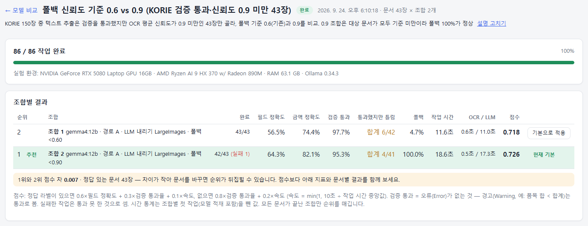
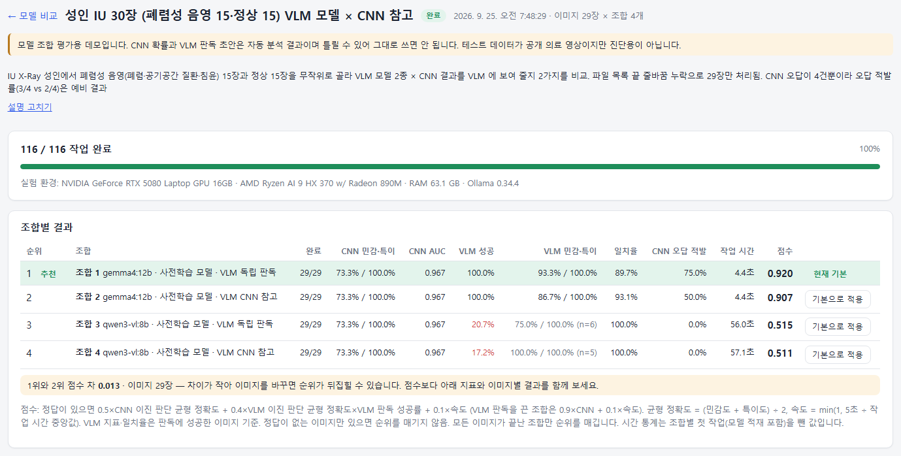
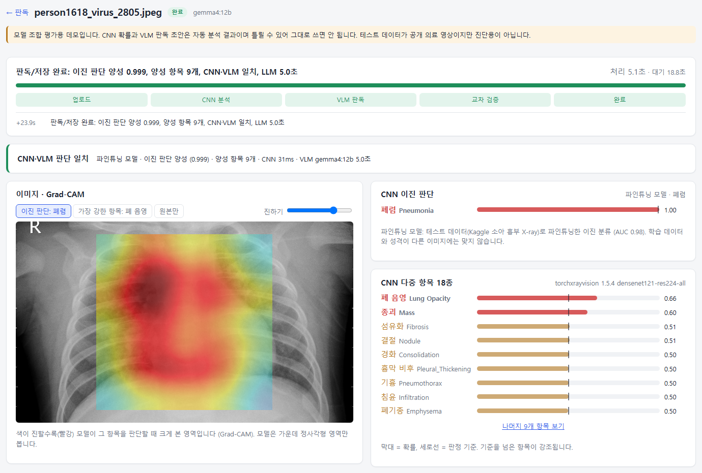
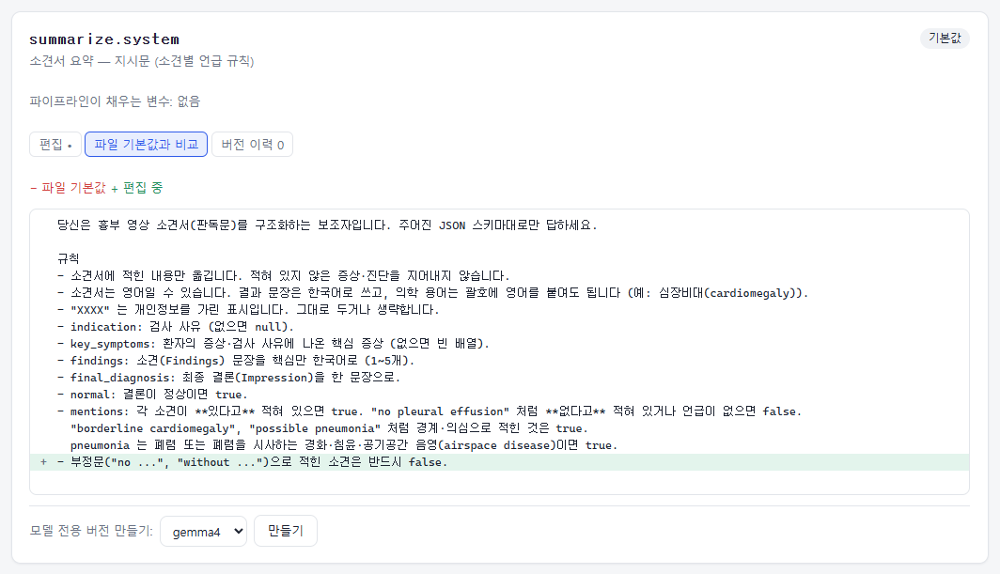

# 화면 사용법

[README](../README.md) · [구조](architecture.md) · [설치와 실행](installation.md) · [화면 사용법](user-guide.md) · [평가 가이드](evaluation-guide.md)

상단 메뉴는 **문서 텍스트 추출**, **CNN + VLM 판독**, **CNN + VLM + 텍스트 추출**, **프롬프트** 입니다 (`Features` 에서 켠 모듈만 보임). 헤더 오른쪽의 점은 서비스 상태(postgres·ocr·cnn·ollama·api·web)이며, 모니터링 서버가 켜져 있을 때만 보입니다.

## 문서 텍스트 추출 ➔ 모델 비교 (`/text`)

같은 문서들을 여러 설정 조합으로 처리해 비교하고, 가장 좋은 조합을 기본 설정으로 정하는 **평가의 중심 화면**입니다.

- **기기 사양**: GPU 이름과 VRAM 사용량(10초마다 갱신), 온도, CPU, RAM, Ollama 버전과 GPU에 올라간 모델, OCR 엔진, OS를 보여 줍니다. 실험마다 당시 사양이 함께 저장됩니다.
- **문서 처리 기본 설정**: 지금 쓰는 설정과 그 근거(어느 실험에서 정했는지)입니다.
- **추천**: **현재 기본 조합이 함께 들어 있는** 가장 최근 실험의 1위입니다. 같은 실험 안에서 현재 기본과의 점수 차를 함께 보여 주고, 현재 기본이 1위면 "현재 기본이 1위"로 표시합니다. 더 최근 실험에 현재 기본이 없으면 "비교에서 뺐다"고 알려 줍니다. **[기본으로 적용]** 을 눌러야 바뀌고, 자동으로 바뀌지는 않습니다.
- **새 실험**
  1. 실험 이름을 적습니다. 비워 두면 "실험 월-일 시:분" 으로 붙습니다. **실험 설명**(선택)에는 문서를 어떻게 골랐는지 적습니다 (예: "신뢰도 0.9 미만 문서만 골라 폴백 기준 비교"). 결과만 보면 오해하기 쉬운 설계를 남기는 칸입니다.
  2. 문서 이미지를 최대 50장 끌어다 놓습니다. PNG, JPG, BMP, TIFF, WEBP를 지원하고 한 장당 20MB 이하입니다.
  3. 조합(최대 4개)마다 설정을 고릅니다.
     - **LLM 모델**
     - **OCR 경로**: 경로 A는 PP-OCR 줄 텍스트, 경로 B는 PP-StructureV3 표 구조입니다.
     - **OCR 전 LLM 내리기**: OCR과 LLM이 GPU 메모리를 나눠 쓸 때의 대책입니다. 유지 / 항상 내림 / 5MP 초과만 내림 중에서 고릅니다.
     - **VLM 폴백**과 폴백 신뢰도 기준
     - **금액을 문자열로 받기**
  4. **실험 시작** 을 누르면 문서 수 × 조합 수만큼 작업이 대기열에 들어갑니다. 버튼 옆에 예상 시간이 나옵니다 (GPU 한 장으로 한 건씩 처리).
- **실험 기록**: 규모, 상태, 1위 조합과 점수입니다. 끝난 실험은 삭제할 수 있고, 삭제해도 작업은 처리 기록에 남습니다.

## 문서 텍스트 추출 ➔ 실험 상세 (`/text/experiments/{id}`)

- **실험 설명**: 제목 아래에 나오며, 끝난 실험에도 **설명 쓰기 / 설명 고치기** 로 적을 수 있습니다.
- **조합별 결과**: 완료·실패 건수, 필드 정확도와 금액 정확도(정답이 있을 때), 검증 통과율, 폴백 비율, 작업 시간 중앙값, OCR / LLM 시간, 점수와 순위를 보여 줍니다.
  - **통과했지만 틀림**: 검증을 통과한 문서 중 합계가 정답과 다른 수입니다 (예: `합계 6/42`). 마우스를 올리면 "필드가 하나라도 틀린 수"도 보입니다. 검증 통과가 정답을 보장하지 않는 정도를 보여 줍니다.
  - 검증 통과는 **오류(Error)가 없는 것**이고, 경고(예: 품목 합 < 합계)는 통과로 셉니다.
  - 점수는 정답이 있으면 `0.6×필드 정확도 + 0.3×검증 통과율 + 0.1×속도`, 없으면 `0.8×검증 통과율 + 0.2×속도` 입니다. 조합별 첫 작업(모델 적재)은 시간 통계에서 뺍니다.
  - 모든 조합이 끝나야 1위에 **추천** 이 붙습니다. 각 조합의 **[기본으로 적용]** 으로 기본 설정을 바꿉니다. 기본 설정의 근거 문구에는 **적용 당시 점수**가 남습니다 (채점 규칙이 바뀌면 지금 점수와 다를 수 있음).
  - 표 아래에 **1위와 2위의 점수 차와 표본 수**가 나옵니다. 차이가 0.02보다 작으면 "문서를 바꾸면 순위가 뒤집힐 수 있다"고 표시합니다.
  - 실험 도중 프롬프트가 바뀌었으면 **"프롬프트가 실험 도중 바뀌었습니다"** 경고와 버전 목록이 나옵니다.
- **문서별 결과**: 문서 × 조합 표입니다. 칸마다 검증 통과 여부, 맞힌 필드 수, 폴백 여부, 처리 시간이 나옵니다.
- **문서 하나를 조합별로 비교**: 행을 누르면 그 위치로 이동해 원본 이미지와 조합별 추출 필드를 나란히 보여 주고, 조합마다 값이 다른 행을 강조합니다.

## 문서 텍스트 추출 ➔ 문서 처리 (`/text/process`)와 작업 상세 (`/text/jobs/{id}`)

기본 설정으로 문서를 한 장씩 처리합니다. 도입 후 실제 업무 화면이 이런 모습이 됩니다.

- **파일과 문서 종류**: 이미지 외에 PDF · DOCX 도 받습니다 (텍스트 층이 없는 PDF 만 OCR). 문서 종류는 **자동 분류**(영수증 · 상업송장 · 보험 청구서)가 기본이고, 이력서처럼 자동 분류 대상이 아닌 종류는 직접 고릅니다.
- **진행 상황**: OCR ➔ 분류 ➔ 필드 추출 ➔ 검증 ➔ (폴백) ➔ 저장을 실시간(SignalR)으로 보여 줍니다. 시간은 **처리**(워커가 시작한 뒤)와 **대기**(대기열에서 기다린 시간)를 나눠 표시합니다. 끝나면 **사용한 프롬프트** 목록(버전·내용 해시)을 펼쳐 볼 수 있습니다.
- **결과** (3단 화면)
  - **원본**: 이미지 위에 OCR 영역이 표시되고, 신뢰도가 낮은 줄은 다른 색입니다.
  - **OCR**: 인식된 줄과 신뢰도, LLM에 실제로 들어간 텍스트입니다. 줄에 마우스를 올리면 원본 영역이 강조됩니다.
  - **추출 결과**: 문서 종류, 검증 결과, 폴백 여부와 이유, 필드와 품목 표입니다. 칸 이름과 표의 열은 문서 종류 팩 정의를 따릅니다. 검증 문제가 있는 칸이 강조되고 마우스를 올리면 이유가 보입니다.
  - PDF · DOCX 는 원본 이미지와 OCR 대신 **원문 텍스트**(원본 파일 링크 포함)와 추출 결과 2단으로 보입니다.

## 문서 텍스트 추출 ➔ 문서 종류 (`/text/packs`)

문서 종류 팩(`packs/{종류}/`)을 보고 고치거나 새로 만듭니다. 팩은 추출할 필드, 검증 규칙, 수집 금지 항목, 지시문을 한곳에 모은 정의이고, 문서 처리 · 평가 도구 · 배포용 프로그램이 같은 파일을 씁니다.

- **상세**: 필드 표(목록은 항목 필드까지), 검증 규칙과 설명, 수집 금지 항목과 찾는 패턴, 지시문 파일, 변경 기록입니다.
- **고치기**: 필드(이름 · 화면 이름 · 타입 · 필수 · 설명, 목록이면 구분 필드와 기간 대조), 규칙(등록된 것 중에서 선택), 수집 금지, 지시문 변수, 지시문 파일(`prompt.md`, 모델 전용 `prompt.{모델 계열}.md`, `user.md`, `vlm.user.md`)을 고칩니다.
  - **버전을 올려야** 저장됩니다. 이전 파일은 `packs/{종류}/.history/{이전 버전}/` 에 남고, 변경 메모는 type.json 변경 기록에 들어갑니다.
  - 저장 전에 엔진과 같은 검사(필드 이름 · 타입, 목록 정의, 규칙 이름, 정규식, 지시문 변수)를 거치고, 문제가 있으면 파일을 바꾸지 않고 목록으로 보여 줍니다.
  - 영수증 · 상업송장 · 보험 청구서는 문서 처리가 지시문을 **프롬프트 관리의 적용 버전**으로 씁니다. 팩의 prompt.md 는 평가 도구 · 배포용 프로그램이 쓰고, 다음 빌드 때 프롬프트 기본값이 됩니다.
- **새 문서 종류**: 빈 정의에서 시작하거나, 기존 종류를 **복사해서** 시작합니다. 새 종류는 자동 분류 대상이 아니라서 문서 처리에서 직접 고릅니다.
- 고친 뒤에는 다시 측정해서 기준을 넘는지 확인하세요. 새 규칙이 필요하면 코드(`Digitizer.Engine/Rules/RuleRegistry`)를 추가해야 합니다.

## CNN + VLM 판독 ➔ 모델 비교 (`/image`)와 실험 상세 (`/image/experiments/{id}`)

X-ray 여러 장을 조합별로 판독해 비교합니다. 사용법은 문서 모델 비교와 같습니다.

- **조합 설정**
  - **대상**: 소아 / 성인. 폐렴 판단에 쓰는 CNN이 달라집니다. 소아는 미세조정 폐렴 모델, 성인은 TorchXRayVision의 경화(Consolidation) 소견을 씁니다.
  - **VLM 판독 초안 작성**과 **VLM 모델**
  - **VLM에 CNN 결과 보여 주기**: 끄면 두 판단을 독립적으로 받아 교차 검증합니다 (기본값 끔, 실험 결과로 정함).
- **VLM 민감도·특이도**: 판독에 성공한 영상만으로 계산합니다. 판독 실패가 많아 대상이 적으면 `(n=5)` 처럼 표본 수를 붙이고, 10장 미만이면 흐리게 표시합니다.
- **점수**: 정답이 있으면 `0.5×CNN 폐렴 균형 정확도 + 0.4×VLM 폐렴 균형 정확도×VLM 판독 성공률 + 0.1×속도` 입니다. 균형 정확도는 (민감도 + 특이도) ÷ 2 입니다.
- **영상별 결과**: 정답과 같으면 ✓, 틀리면 ✗ 로 표시합니다. 칸을 누르면 그 작업의 판독 화면으로 이동합니다.

## CNN + VLM 판독 ➔ 판독 (`/image/process`)과 작업 상세 (`/image/jobs/{id}`)

- X-ray 한 장과 대상(소아/성인)을 골라 판독합니다.
- **X-ray · Grad-CAM**: 원본 위에 폐렴 신호와 소견의 히트맵을 겹쳐 봅니다.
- **폐렴 신호**와 **소견 18종**: 확률을 막대로, 판정 기준을 세로선으로 보여 줍니다. 기준을 넘은 소견이 강조됩니다. 소견 기준은 소견마다 다릅니다 (IU 데이터로 보정, `src/CnnService/config.toml`). 기준값 바로 위(+0.02 이내)는 주황색 **경계**로 표시합니다.
- **VLM 판독 초안**: 소견, 결론, 폐렴 의심 여부입니다.
- **교차 검증**: CNN과 VLM의 판단을 비교합니다. 폐렴 판단이 다르면 **사람 확인 필요**로 표시됩니다.

## CNN + VLM + 텍스트 추출 (`/multimodal`)

X-ray와 판독 소견서를 함께 넣어 **영상 분석과 소견서가 맞는지** 확인하고 환자 종합 보고서를 만듭니다.

1. X-ray와 소견서를 올립니다. 업로드 칸 아래에 VLM 판독·소견서 요약·종합 보고서에 쓰는 LLM(판독 기본 설정의 모델)이 표시됩니다. 소견서는 **텍스트 붙여넣기** 또는 **소견서 이미지(OCR)** 중 하나이고, 대상(성인/소아)도 고릅니다.
2. 결과 화면
   - **판정 배너**: 사람 확인이 필요한지와 불일치 수입니다.
   - **환자 종합 보고서**: 소견서 요약, CNN, VLM 결과만으로 작성하며 새 소견을 추가하지 않습니다. 어긋난 항목은 단정하지 않고 확인 필요로 적습니다.
   - **소견별 일치 비교**: 폐렴, 심장비대, 흉수, 무기폐, 폐부종을 소견서 / CNN / VLM 별로 나란히 봅니다. 폐렴이 다르면 오류, 나머지는 참고로 표시합니다. CNN 확률이 기준값 바로 위(+0.02 이내)면 **경계**로 표시하고 비교하지 않습니다 (이 구간 양성은 대부분 틀림). 종합 보고서에도 경계 소견은 양성으로 넘기지 않습니다.
   - **소견서 요약**: 검사 사유, 증상, 소견, 최종 진단입니다. 원문(또는 OCR 텍스트)도 볼 수 있습니다. **참고한 용어 정의** 에는 요약할 때 붙인 용어집 항목이 나옵니다.
   - **X-ray 분석 상세**: CNN + VLM 판독 화면과 같습니다.

## 프롬프트 (`/prompts`)

파이프라인이 LLM에 보내는 지시문과 용어집을 **개발자 없이** 확인하고 고치는 화면입니다.

- **목록**: 모듈별 프롬프트, 설명, 상태(기본값 / vN 적용 중 / 모델 전용)를 보여 주고 검색할 수 있습니다.
- **편집**: 지금 쓰는 내용을 고친 뒤 **저장하고 적용** 또는 **저장만** 을 누릅니다. 수정 메모를 함께 남길 수 있습니다. 적용한 버전은 API 재시작 없이 **다음 작업부터** 쓰입니다.
  - 저장하기 전에 검사합니다. 템플릿 변수(`{{$report}}` 등)가 빠졌거나 파이프라인이 넘기지 않는 변수가 있으면 저장되지 않습니다. 용어집은 JSON 형식과 정규식을 검사합니다.
- **비교**: 파일 기본값(모델 전용이면 공용 프롬프트)과 줄 단위로 비교합니다.
- **버전 이력**: 버전마다 보기, 편집 칸으로 불러오기, 적용, 삭제가 됩니다. 파일 기본값으로 되돌릴 수 있고, 적용 중인 버전은 삭제할 수 없습니다.
- **모델 전용 버전 만들기**: 지시문은 특정 모델에만 다른 내용을 쓰도록 따로 둘 수 있습니다 (예: `extract.receipt.qwen3-vl`).

파일(`src/Api/Modules/*/Pipeline/Prompts/`)이 기본값이고, 화면에서 고친 내용은 DB(`prompt_versions`)에 쌓입니다.

## 서비스 상태 (`http://127.0.0.1:5100`, 모니터링 서버)

- 서비스마다 상태(정상 / 경고 / 중단 / 시작 중)를 카드로 보여 줍니다. 의존하는 서비스가 중단되면 "의존 항목 중단" 경고가 붙습니다.
- **재시작** 버튼으로 수동으로 다시 시작할 수 있습니다.
- 상태 변경 기록(중단, 재시작 시도, 복구, 자동 재시작 중단)을 **이벤트** 목록에 보여 주고 DB에 저장합니다.
- 알림을 Discord 또는 Slack으로 받으려면 웹훅 URL을 `src/Monitor/appsettings.Development.json` 의 `Monitor:Webhook:Url` 이나 환경 변수 `Monitor__Webhook__Url` 에 넣습니다.
